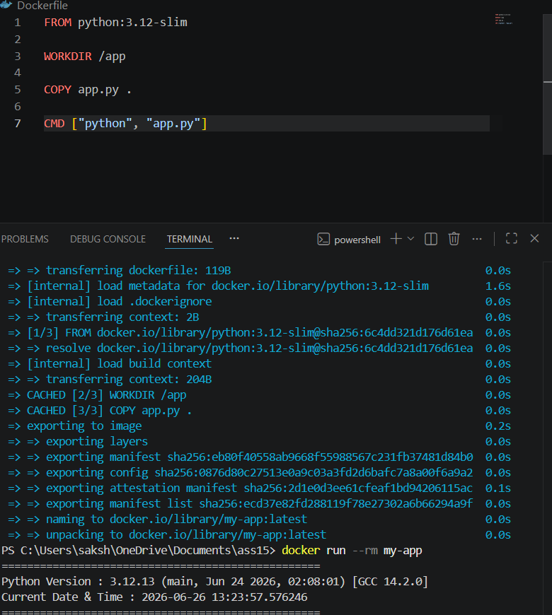

# Dockerized Python Application

This project demonstrates a simple Dockerized Python application using the official **Python 3.12 Slim** image.

## Features

* Uses `python:3.12-slim` as the base image
* Displays the Python version running inside the container
* Displays the current date and time
* Automatically executes when the container starts

---

## Build Docker Image

Run the following command in the project directory:

```bash
docker build -t my-app .
```

---

## Run Docker Container

```bash
docker run --rm my-app
```

---

## Sample Output

```text
==================================================
Python Version : 3.12.13 (main, Jun 24 2026, 02:08:01) [GCC 14.2.0]
Current Date & Time : 2026-06-26 13:23:57.576246
==================================================
```

---

## Screenshot




